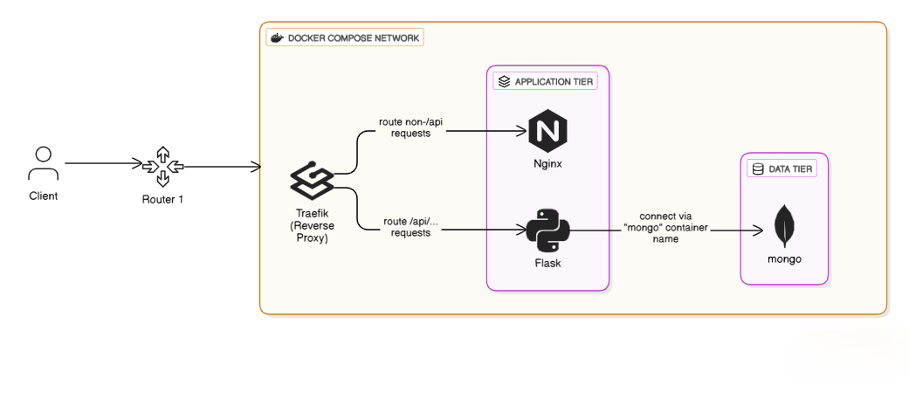

# Event Management

This project is an event booking website built with React for the frontend, Flask for the backend, and MongoDB for the database. The backend code can be found in the `Backend` folder, while the frontend code is located in the `Frontend` folder.

## Architecture



## Installation

1. Clone the repository:

    ```bash
    git clone https://github.com/KrishnaChaitanya20/EventManagement.git
    ```

2. Set up the MongoDB database:

    - Install MongoDB and start the MongoDB service.
    - Create a new database named `events`.

3. Update the environment variables:

    - In `Backend` folder rename `.env.example` to `.env`
    - Update the database connection details in the `.env` file.
    - In `Frontend` folder rename `.env.example` to `.env`
    - Update the backend connection details in the `.env` file.

## Usage

You can either start the backend and frontend servers separately or use Docker Compose to run the entire application.

### Option 1: Starting the backend and frontend servers separately

#### Part 1: Starting the backend server

1. Open a terminal and navigate to the `Backend` folder:

    ```bash
    cd Backend
    ```

2. Install the required dependencies:

    ```bash
    pip install -r requirements.txt
    ```

3. Start the backend server:

    ```bash
    python app.py
    ```

#### Part 2: Starting the frontend server

1. Open another terminal and navigate to the `Frontend` folder:

    ```bash
    cd Frontend
    ```

2. Install the required dependencies:

    ```bash
    npm ci
    ```

3. Start the frontend server:

    ```bash
    npm start
    ```

### Option 2: Using Docker Compose

1. Ensure Docker and Docker Compose are installed on your machine.

2. Navigate to the root directory of the project where the `docker-compose.yml` file is located.

3. Start the services using Docker Compose:

    ```bash
    docker-compose up -d
    ```

4. Access the website in your browser at `http://localhost:3000`.

## Contributing

Contributions are welcome! If you would like to contribute to this project, please follow these steps:

1. Fork the repository.
2. Create a new branch for your feature or bug fix.
3. Make your changes and commit them.
4. Push your changes to your forked repository.
5. Submit a pull request.
